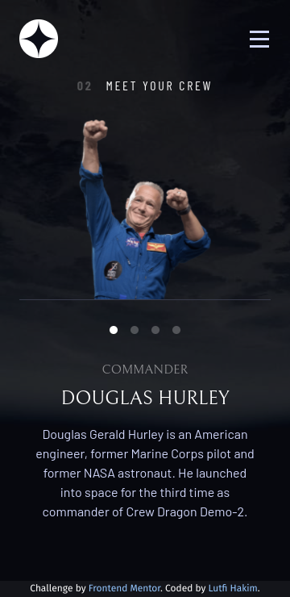

# Frontend Mentor - Space tourism website solution

This is a solution to the [Space tourism website challenge on Frontend Mentor](https://www.frontendmentor.io/challenges/space-tourism-multipage-website-gRWj1URZ3). Frontend Mentor challenges help you improve your coding skills by building realistic projects. 

## Table of contents

- [Overview](#overview)
  - [The challenge](#the-challenge)
  - [Screenshot](#screenshot)
    -[Mobile](#mobile)
    -[Tablet](#tablet)
    -[Desktop](#desktop)
  - [Links](#links)
- [My process](#my-process)
  - [Built with](#built-with)
  - [What I learned](#what-i-learned)
  - [Continued development](#continued-development)
- [Author](#author)


## Overview

### The challenge

Users should be able to:

- View the optimal layout for each of the website's pages depending on their device's screen size
- See hover states for all interactive elements on the page
- View each page and be able to toggle between the tabs to see new information

### Screenshot

#### Mobile





#### Tablet


#### Desktop


### Links

- Solution URL: [Solution](https://www.frontendmentor.io/solutions/space-tourism-using-vue-and-tailwind-lhoQC-9aA)
- Live Site URL: [Live Site](https://lutfi-frontendmentor-space-tourism.vercel.app/)

## My process

### Built with

- [Vue.Js 3](https://v3.vuejs.org/)
- [Tailwindcss](https://tailwindcss.com/)

### What I learned

I was learn a lot og think trough this project. I am so excited with this challange because this is the Free+ challenge, so I can get the figma file. Therefore, when I make this, I want to reach my limit and exceed it. I make some transition animation on the image, this one of function I use.

```js
export function goToNextImage(currentImageElement: HTMLElement | undefined, nextImageElement: HTMLElement | undefined) {
  currentImageElement?.classList.add('-translate-x-full', 'transition-tansform', 'duration-500');
  nextImageElement?.classList.add('-translate-x-full', 'transition-tansform', 'duration-500');

  setTimeout(() => {
    currentImageElement?.classList.replace('flex', 'hidden');
    currentImageElement?.classList.remove('-translate-x-full', 'transition-tansform', 'duration-500');
    setTimeout(() => {
      currentImageElement?.classList.replace('hidden', 'flex');
      setTimeout(() => {
        nextImageElement?.classList.replace('flex', 'hidden');
        nextImageElement?.classList.remove('-translate-x-full', 'transition-tansform', 'duration-500');
        setTimeout(() => {
          nextImageElement?.classList.replace('hidden', 'flex');
        }, 50);
      }, 0);
    }, 0);
  }, 500);
};
```
Moreover, I want to focus on the small detail, e.g. I make navbar (on mobile) close when user click on the outside of it, and I change the header background when user start scrolling the page.

This is code I use to hide navbar.
```js
document.addEventListener(
    'click',
    (event) => {
      const target = event.target as Element
      if (
        target.id == 'nav' ||
        target.id == 'nav-button' ||
        target.id == 'nav-button-hamburger' ||
        target.id == 'nav-button-close'
      ) {
        return
      } else {
        isMenuOpen.value = false
      }
    },
    false,
  );
```

This is code I use to change header background
```js
function changeHeaderBackground(position: number) {
  if (position > 48) {
    isScrollOnTop.value = false;
  } else {
    isScrollOnTop.value = true;
  };
};
```

### Continued development

I really appreciate the suggestions from other. If I got some suggestions, I want to fix it.

## Author

- Website - [Lutfi Hakim](https://utfihakim.netlify.app)
- Frontend Mentor - [@lutfihakim28](https://www.frontendmentor.io/profile/lutfihakim28)
- Twitter - [@DevUpi](https://www.twitter.com/DevUpi)
